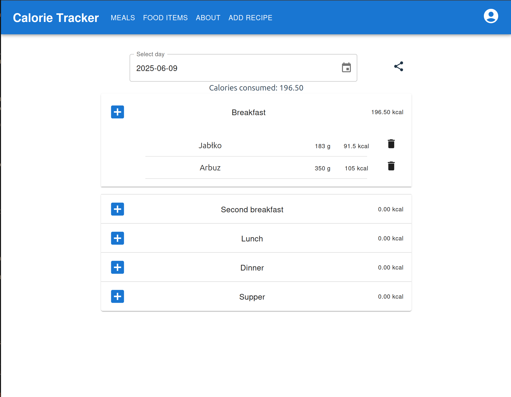

# Calorie Tracker - frontend
This is a frontend portion of my calorie tracker web app

### Meals page
<picture>
    
</picture>

### Add food item page
<picture>
    
</picture>

### Local server - access it here: [calorie-tracker.mysliwczykrafal.pl/login](https://calorie-tracker.mysliwczykrafal.pl/login)
<picture>
    
</picture>

## General overview:
This web application enables users to monitor their caloric intake by logging their daily meals. The main feature of the app is a database that users can update with their favorite food products. For each product, the database stores essential nutritional values per 100 grams, including calories, fats, carbohydrates, and proteins. Users can add their products and search for them using a responsive search function or by scanning product barcodes.

## Frontend overview
The frontend portion of the web app uses React + Vite and can be accessed [here](https://calorie-tracker.mysliwczykrafal.pl) Credentials for testing: login: test password: test

## Tech stack/features - frontend
- Vite
- Typescript
- React
  - React Router - for simple routing between pages
  - React Hook Form + Zod - for frontend forms validation (not all forms use it)
- Docker - for continuous deployment
- Jenkins - for continuous deployment

## How to Run the Application locally
Create an .env file as shown in .env.example. Make sure you have Node.js and npm installed. For Debian-based systems, you can ensure you have everything you need by entering the following command:
```bash
sudo apt install npm nodejs
``` 
Once you have cloned or downloaded the source code, navigate to the root folder of the calorie-tracker and run the following commands: 
```bash
npm install
npm run dev
``` 
